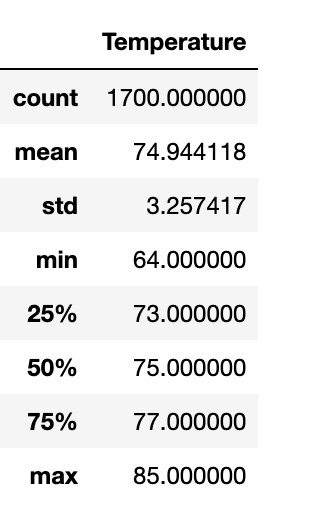
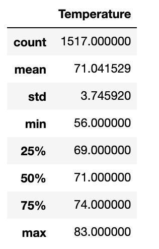

# Surfs_Up

## Overview
The purpose of this analysis is to provide information on temperature trends in Oahu, Hawaii.  The temperate trends will help business investors determine if this location is a valid location to open a surf shop and help determine it's futuer success.  I specifically looked at the months of June and Decemeber, to determine is these months will help the surf and ice cream shop be sustainable year round.

## Results

I created two deliverables generated summary statistics from a DataFrame, which originated from a working query.  I imported my dependecies of numpy, pandas, and sqlalchemy to create  an engine, reflect the database in a model, reflect the tables of the database, and save each data as their own variables.  I then created a session to link Python to the database in order to query the data.  I wrote two queries to retrieve temperatures for the months of June and Decemeber.  I converted both queries into a list and  put them in a dataframe.  I was then able to generate summary statistic using the describe() function.
 

 
The summary stats for December temperatures are slightly lower than the June stats.  
- In the dataset evaluated, June has a max temperaute of 85 degrees, an average of about 75 degrees, and a min of 64 degrees.  
- Decemeber has a max temperate of 83 degrees, an average of 71 degrees, and a min of 56 degrees.  The max and average for the two months are relatively similar.  
- The min temperate has a larger variance between the two months, however, the 25th percentile for Decemeber is 69 degrees, which is closer to the 25th percentile of June, which is 73 degrees.  

## Summary

Based off the summary statistics, I would advice that the Surf and Ice cream shop is a good business venture for the investors.  To analysis this further, two additional queries I could write are as follows:
 
session.query(Measurement.date, Measurement.prcp).filter(extract('month', Measurement.date)==6)
 
session.query(Measurement.date, Measurement.prcp).filter(extract('month', Measurement.date)==12)
 
These queries could be used to evalute the precipitation in the months of June and December.  While temperature is important, rainfall could also affect ice cream and surf sales, as people are less likely to come surfing in rainy weather.  We can use these queries to determine is there is a rainy season that would affect sales.
