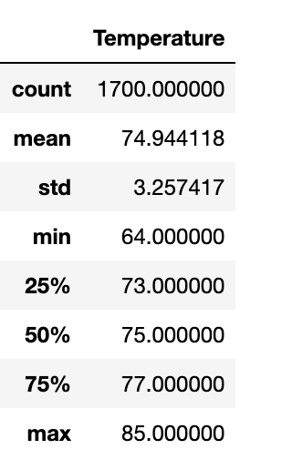
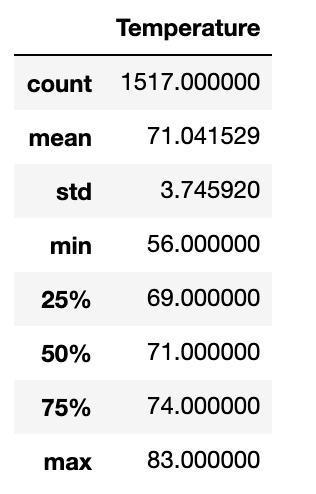

# Hawaii Climate Analysis

## About the Project
This analysis provides information on temperature trends in Oahu, Hawaii.  The temperature trends will help business investors determine if this location is a valid to open a surf and ice cream shop and help determine it's further success.  I specifically looked at the months of June and Decemeber, to determine is these months will help the surf and ice cream shop be sustainable year round.  I connected to a SQLite database and used sqlalchemy to reflect the existing hawaii database and create a session from Python to the database.  I then wrote queries in jupyter notebook to retrieve temperature trends, converted the query results into a dataframe, and generated summary statistics on the dataframe using the describe() method.

### Results

 

 
- The summary stats for December temperatures are slightly lower than the June stats.  
- In the dataset evaluated, June has a max temperaute of 85 degrees, an average of about 75 degrees, and a min of 64 degrees.  
- Decemeber has a max temperate of 83 degrees, an average of 71 degrees, and a min of 56 degrees.  The max and average for the two months are relatively similar.  
- The min temperate has a larger variance between the two months, however, the 25th percentile for Decemeber is 69 degrees, which is closer to the 25th percentile of June, which is 73 degrees.  

### Recommendations 

Based off the summary statistics, I would advice that the Surf and Ice cream shop is a good business venture for the investors, but to continue with further analysis. The below queries could be used to evalute the precipitation in the months of June and December.  While temperature is important, rainfall could also affect ice cream and surf sales, as people are less likely to come surfing in rainy weather.  We can use these queries to determine is there is a rainy season that would affect sales. 
 
session.query(Measurement.date, Measurement.prcp).filter(extract('month', Measurement.date)==6)
 
session.query(Measurement.date, Measurement.prcp).filter(extract('month', Measurement.date)==12)
 

### Built With

- Python
- Jupyter Notebook
- pandas
- numpy
- datetime
- sqlalchemy.ext.automap
- sqlalchemy.orm
- sqlalchemy
- matplotlib
- matplotlib.plotly
- sqlite
- sqlalchemy

